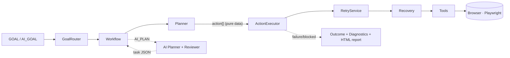

# 🤖 Website Automation Agent

> A modular, fault-tolerant browser-automation **agent framework** (Node.js +
> Playwright) — inspired by [Browser Use](https://github.com/browser-use/browser-use).
> It detects page elements dynamically, plans actions as pure data, executes them
> with retries and self-healing recovery, reports honest outcomes, and can turn a
> **natural-language goal** into a runnable plan via an LLM — behind one stable engine.

<p align="left">
  
  
  
  
  
</p>

---

## 📋 Overview

This is **not** a one-off Playwright script. It is a small agent framework that
follows an **Observe → Think → Act → Verify** loop, routes between goals, plans
actions as serialisable data, and executes them through a single resilient engine:

```
[OBSERVE] Page loaded — title: "Search · GitHub"
[THINK]   Found element via label: "search"  (confidence: HIGH)
[ACT]     Filling field with: "playwright"
[VERIFY]  URL contains expected fragment: "q=playwright"
✅ OUTCOME: SUCCESS — workflow completed and verified.
```

It also turns English into automation — `AI_GOAL="search github for playwright"` —
where an LLM acts as a **planner only** (it emits task JSON; it never drives the
browser), gated by a quality reviewer.

📚 **Docs:** [Project Overview](docs/PROJECT_OVERVIEW.md) ·
[Architecture](docs/ARCHITECTURE.md) · [Test Report](docs/TEST_REPORT.md) ·
[Viva Guide](docs/VIVA_GUIDE.md) · [Resume Bullets](docs/RESUME_BULLETS.md) ·
[Final Audit](docs/FINAL_PROJECT_AUDIT.md)

---

## 🏗 Architecture



Layered (each layer depends only on the one below): **Tools → Services → Agent
(GoalRouter / Planner / ActionExecutor) → Workflows**, with `planners/` (AI) and
`benchmark/` (evaluation) alongside. Full design + diagrams: [docs/ARCHITECTURE.md](docs/ARCHITECTURE.md).

---

## ✨ Key features

- **Accessibility-first detection** — label → ARIA → placeholder → name → CSS, first *visible* match; confidence logged HIGH/MEDIUM/LOW.
- **Goal-routed workflows** — pick a task with `GOAL=` in `.env`; no code changes.
- **Reusable JSON tasks** (`MULTI_STEP`) — variables (`{{q}}`), conditionals (`if/then/else`), `continueOnFailure` — add tasks with **no code**.
- **AI planner** (`AI_PLAN`) — natural language → validated, reviewer-scored task JSON; planner-only; offline fallback.
- **Resilience** — exponential-backoff retries, a self-healing detection recovery ladder, bounded navigation retries, tolerant waits/screenshots.
- **Honest outcomes** — `SUCCESS` / `BLOCKED` (anti-bot) / `FAILED` with exit codes `0 / 2 / 1`, JSON diagnostics, and self-contained HTML run reports.
- **Quality measurement** — a 20-goal **benchmark** + **49 deterministic tests** (no network/keys).

---

## 🤖 AI planner workflow

```
Natural-language goal → PlannerProvider → (OpenRouter | Mock) → task JSON
                      → validate (schema + action allow-list)
                      → TaskReviewer (score 0–100, must be ≥ 80)
                      → MultiStepWorkflow.runTask → ActionExecutor → Browser
```

- **Safe:** invalid/unknown-action output is never executed (raw saved); low-quality plans (< 80) are saved to a review report and skipped.
- **Resilient:** OpenRouter timeout / 429 / auth → automatic fallback to the offline `MockPlanner`.
- **Decoupled:** the executor cannot tell whether a task came from a file, the Mock planner, or OpenRouter.

```bash
AI_GOAL="search github for browser automation" npm run ai     # mock (offline, no key)
PLANNER_MODE=openrouter OPENROUTER_API_KEY=sk-or-... \
  OPENROUTER_MODEL=openai/gpt-4.1-nano AI_GOAL="open the top hacker news story" npm run ai
```

---

## 📊 Benchmark workflow

Measure planner quality objectively across 20 goals (`benchmark/goals.json`):

```bash
npm run benchmark                    # all 20 goals
BENCHMARK_LIMIT=5 npm run benchmark  # first 5 only
```

Each goal runs **plan → review → execute**; outputs `reports/benchmark_report.{json,html}`
with **planning success rate · review approval rate · execution success rate ·
average review score · average execution time**.

---

## 🚀 Quick start

```bash
git clone <your-repo-url> && cd WebsiteAutomation
npm install                 # postinstall fetches Chromium
cp .env.example .env        # then run any demo below
npm run github              # ✅ SUCCESS on a live GitHub search
```

### Installation
- **Prerequisite:** Node.js 18+.
- `npm install` installs deps and (via `postinstall`) the Chromium binary.
- If the browser didn't download: `npx playwright install chromium`.
- Copy `.env.example` → `.env`. All config is documented there.

---

## ▶ Demo commands

```bash
npm start            # runs the goal in .env (default: FILL_SHADCN_FORM)
npm run shadcn       # FILL_SHADCN_FORM — fill a real form, verified
npm run google       # SEARCH_GOOGLE   — may report BLOCKED (CAPTCHA) — by design
npm run github       # SEARCH_GITHUB   — verifies q=<query> + results rendered
npm run task         # MULTI_STEP      — run a JSON task (TASK_FILE=…)
npm run ai           # AI_PLAN         — AI_GOAL="…" → planner → run

# Reusable JSON tasks (no code):
TASK_FILE=wikipedia_search.json  npm run task   # variables + continueOnFailure
TASK_FILE=stackoverflow_search.json npm run task # conditional if/then/else
```

**Demo Mode** (keep the browser open for a viewer):
```bash
KEEP_BROWSER_OPEN=true DEMO_PAUSE_MS=15000 npm run github
```
`KEEP_BROWSER_OPEN=true` holds the browser open (success *and* failure) for
`DEMO_PAUSE_MS`; logs `[DEMO] Keeping browser open for inspection`. Disabled by
default — normal runs close immediately.

---

## 📸 Screenshots

Every run captures timestamped PNGs to `screenshots/` (git-ignored, regenerated):

| Label | When |
|-------|------|
| `browser-launched` / `before-task` | start |
| `*-results` / `*-query-typed` / domain-specific | mid-run evidence |
| `after-task` | final state (success or failure) |
| `detect-failed-*` / `diagnostic-failure` / `blocked-state` | on recovery/failure |

A self-contained **HTML run report** (`reports/report_<ts>.html`) embeds the steps,
retries, recovery events, screenshots, outcome, and final URL.

---

## 📂 Project structure

```
WebsiteAutomation/
├── src/
│   ├── agent/        GoalRouter · Planner · ActionExecutor · Agent
│   ├── workflows/    FillShadcnForm · SearchGoogle · SearchGitHub · MultiStep · AiPlanner
│   ├── planners/     PlannerProvider · OpenRouterPlanner · MockPlanner · TaskReviewer
│   ├── prompts/      versioned planner system prompt (JSON-only contract)
│   ├── services/     ElementDetection · FormDetection · Validation · RetryService
│   ├── tools/        BrowserManager · Navigation · Click · Input · Scroll · Screenshot
│   ├── benchmark/    BenchmarkRunner · run.mjs
│   ├── utils/        logger · diagnostics · report · demoMode · fileHelper · errors
│   ├── config/       env.js · constants.js
│   └── index.js      entry: route → run → outcome → demo → report
├── tasks/            reusable task JSON (+ generated/, git-ignored)
├── benchmark/        goals.json (20 NL goals)
├── tests/            9 deterministic suites
├── docs/             overview · architecture · test report · viva · resume · audit
├── screenshots/  reports/  logs/   (generated, git-ignored)
└── .env.example  package.json  README.md
```

---

## 🧪 Testing

```bash
npm test     # 9 suites · 49 scenarios — deterministic, no network, no API key
```

Suites: resilience · github-verification · google-verification · multi-step ·
engine · planner · reviewer · demo · benchmark. They use controlled `data:` URL
pages and injected fakes. Details + live-validation evidence: [docs/TEST_REPORT.md](docs/TEST_REPORT.md).

---

## 🔮 Future improvements

- GitHub Actions CI (`npm test` headless, gated by exit codes).
- URL allow-listing for AI-generated `navigate` steps.
- Per-step retry overrides and richer task conditions.
- *(Stretch)* vision-based detection fallback · self-correcting recovery · parallel contexts.

Full list + technical debt: [docs/FINAL_PROJECT_AUDIT.md](docs/FINAL_PROJECT_AUDIT.md).

---

## 📝 License

MIT — free to use, learn from, and extend.

<sub>Built to demonstrate agent design patterns, resilient browser automation, safe LLM integration, and clean layered architecture in Node.js.</sub>
