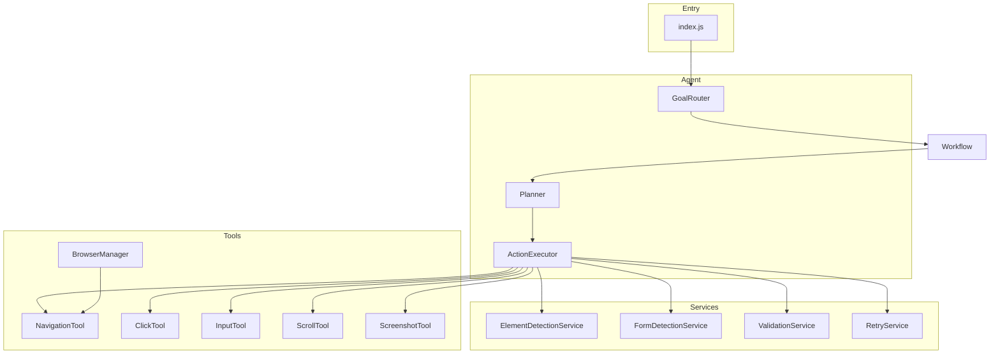
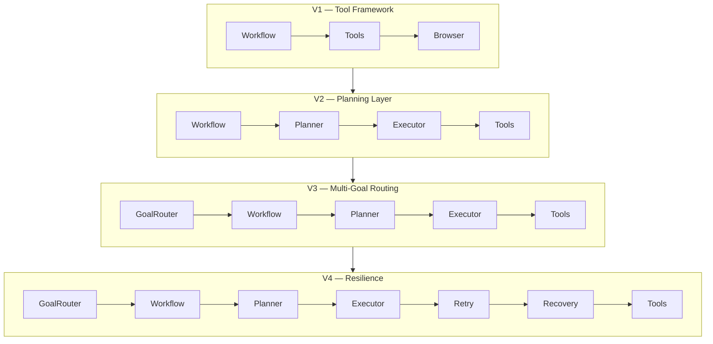
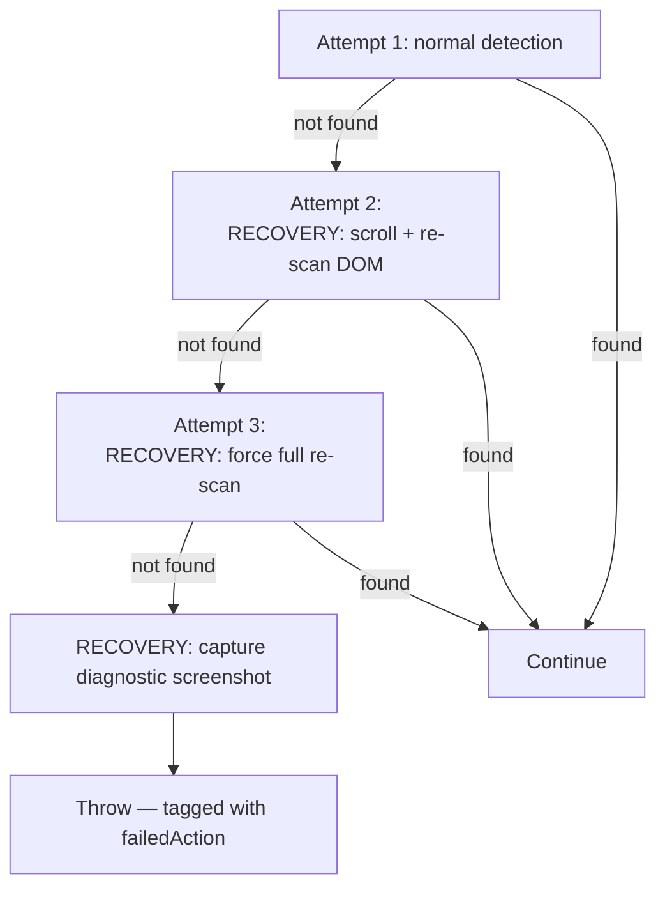

# 🤖 Website Automation Agent

> A modular, fault-tolerant browser automation **agent framework** built with Node.js and Playwright — inspired by [Browser Use](https://github.com/browser-use/browser-use).

It is **not** a one-off Playwright script. It is a small agent framework that *observes* a page, *thinks* about what it sees, *acts*, and *verifies* — retrying and self-healing when the real web misbehaves.

<p align="left">
  
  
  
  
</p>

---

## 📑 Table of Contents

- [Project Overview](#-project-overview)
- [Motivation](#-motivation)
- [Architecture](#-architecture)
- [Features](#-features)
- [Workflow Examples](#-workflow-examples)
- [Folder Structure](#-folder-structure)
- [Installation](#-installation)
- [Configuration](#-configuration)
- [Running Workflows](#-running-workflows)
- [Testing](#-testing)
- [Recovery Layer](#-recovery-layer)
- [Diagnostics System](#-diagnostics-system)
- [Screenshots](#-screenshots)
- [Future Roadmap](#-future-roadmap)

---

## 🔭 Project Overview

The Website Automation Agent opens a browser, navigates to a target page, **dynamically detects** the elements it needs (using accessibility-first heuristics), performs actions, captures screenshots, logs every reasoning step, and **recovers from failures** instead of crashing.

Every action follows an **Observe → Think → Act → Verify (OTAV)** loop, surfaced through a custom colour-coded logger so the agent's "reasoning" is visible in real time.

```
[OBSERVE] Page loaded — title: "React Hook Form - shadcn/ui"
[THINK]   Found element via label: "name"
[ACT]     Filling field with: "Jane Doe"
[VERIFY]  Field value matches: "Jane Doe"
```

---

## 💡 Motivation

Most "automation projects" are a single brittle script with hardcoded CSS selectors that breaks the moment a page changes. This project was built to demonstrate the difference between **a script** and **an agent**:

| A script | This agent |
|----------|------------|
| Hardcoded selectors | Accessibility-first dynamic detection (label → ARIA → placeholder → name → CSS) |
| One task | Goal-routed, multi-workflow framework |
| Crashes on first hiccup | Retries with backoff + self-healing recovery |
| "It broke" | Structured diagnostic reports (screenshot + URL + failed action) |
| Mixed what/how | Layered: Goal → Workflow → Planner → Executor → Tools |

The goal: an **extensible foundation** that could later grow an AI reasoning layer — without rewriting the core.

---

## 🏗 Architecture

### Core flow (V4)

```mermaid
flowchart LR
    A[Goal<br/>.env GOAL=] --> B[GoalRouter]
    B --> C[Workflow]
    C --> D[Planner]
    D -->|action&#91;&#93; pure data| E[ActionExecutor]
    E --> F[RetryService<br/>exp backoff]
    F --> G[Recovery<br/>ladder]
    G --> H[Tools]
    H --> I[(Browser<br/>Playwright)]
    E -.failure.-> J[Diagnostics<br/>logs/errors/*.json]
```



### Layered responsibilities



### Architecture evolution (V1 → V4)



| Version | Theme | Key addition | Doc |
|---------|-------|--------------|-----|
| **V1** | Tool framework | OTAV loop, Winston logging, tools/services split | — |
| **V2** | Planning layer | `Planner` emits pure-data action plans; field registry | [ARCHITECTURE_V2.md](docs/ARCHITECTURE_V2.md) |
| **V3** | Multi-goal routing | `GoalRouter` registry; 3 workflows; switch via `.env` | [ARCHITECTURE_V3.md](docs/ARCHITECTURE_V3.md) |
| **V4** | Resilience | `RetryService`, recovery ladder, Diagnostic Mode | [ARCHITECTURE_V4.md](docs/ARCHITECTURE_V4.md) |

> **Design principle:** each version *extended* the architecture without rewriting working code. A new workflow is one import + one `.register()` call; an AI planner would be a single method swap.

---

## ✨ Features

- **Observe → Think → Act → Verify** loop with a custom colour-coded Winston logger (`OBSERVE`/`THINK`/`ACT`/`VERIFY`/`PLAN`/`RECOVERY` levels).
- **Accessibility-first element detection** — tries label → ARIA role → placeholder → name attribute → CSS, returning the first *visible* match.
- **Goal-routed workflows** — pick the task with `GOAL=` in `.env`, no code changes.
- **Pure-data action plans** — the `Planner` outputs serialisable `action[]`, logged in full *before* execution (AI-ready seam).
- **Automatic retries** with exponential backoff (500 → 1000 → 2000 ms), configurable.
- **Self-healing recovery ladder** for field detection (scroll & re-scan → full re-scan → diagnostic).
- **Diagnostic Mode** — failures write a JSON report with screenshot, URL, page title, failed action, and timestamp.
- **Timestamped screenshots** at every key step.
- **Zero hardcoded brittle selectors** in the happy path.

---

## 🧩 Workflow Examples

| Goal | What it does | Detection highlight |
|------|--------------|---------------------|
| `FILL_SHADCN_FORM` | Fills the shadcn React Hook Form demo (name + description) and verifies values | Accessible `<label>` matching |
| `SEARCH_GOOGLE` | Searches Google for a query and verifies the results URL | ARIA searchbox / `name="q"` |
| `SEARCH_GITHUB` | Searches GitHub via `/search` and verifies the results URL | Visible-input filtering past hidden header button |

Example (shadcn) plan, logged before anything runs:

```
[PLAN] === Planning goal: "FILL_SHADCN_FORM" ===
[PLAN] Plan contains 15 steps:
[PLAN]   Step 01: Navigate → https://ui.shadcn.com/docs/forms/react-hook-form
[PLAN]   Step 07: Detect field "name"
[PLAN]   Step 10: Fill "name" → "Jane Doe"
[PLAN]   Step 11: Verify "name" === "Jane Doe"
...
```

---

## 📂 Folder Structure

```
WebsiteAutomation/
├── src/
│   ├── agent/                    # Orchestration
│   │   ├── Agent.js              #   composition root + OTAV log helpers
│   │   ├── GoalRouter.js         #   goal key → workflow (registry pattern)
│   │   ├── Planner.js            #   goal → pure-data action[]
│   │   └── ActionExecutor.js     #   dispatch + retry + recovery ladder
│   ├── workflows/                # Task-specific flows (goal-oriented)
│   │   ├── FillShadcnFormWorkflow.js
│   │   ├── SearchGoogleWorkflow.js
│   │   └── SearchGitHubWorkflow.js
│   ├── services/                 # Reusable business logic
│   │   ├── ElementDetectionService.js   # label > aria > placeholder > name > css
│   │   ├── FormDetectionService.js      # scan & classify fields
│   │   ├── ValidationService.js         # verify value/visible/enabled/URL/page
│   │   └── RetryService.js              # exponential-backoff retry utility
│   ├── tools/                    # Low-level Playwright wrappers
│   │   ├── BrowserManager.js  NavigationTool.js  ScreenshotTool.js
│   │   ├── InputTool.js       ClickTool.js       ScrollTool.js
│   ├── utils/                    # Shared helpers
│   │   ├── logger.js   fileHelper.js   diagnostics.js
│   ├── config/                   # Configuration
│   │   ├── env.js      constants.js
│   └── index.js                  # Entry point
├── tests/
│   └── resilience.test.mjs       # Deterministic retry/recovery scenarios
├── docs/                         # Architecture, test reports, viva & demo guides
├── screenshots/                  # Timestamped run screenshots (generated)
├── logs/                         # agent.log, errors.log, errors/*.json (generated)
├── .env.example                  # Copy to .env
└── README.md
```

---

## 🛠 Installation

**Prerequisites:** Node.js 18+.

```bash
# 1. Clone
git clone <your-repo-url>
cd WebsiteAutomation

# 2. Install dependencies (postinstall fetches the Chromium binary automatically)
npm install

# If the browser binary did not download automatically:
npx playwright install chromium
```

---

## ⚙ Configuration

All configuration lives in `.env` (loaded via `dotenv`, validated in `src/config/env.js`). Copy the template and edit:

```bash
cp .env.example .env
```

| Variable | Default | Purpose |
|----------|---------|---------|
| `GOAL` | `FILL_SHADCN_FORM` | Which workflow to run |
| `HEADLESS` | `false` | Hide the browser window |
| `SLOW_MO` | `50` | Per-action delay (ms) for readable demos |
| `PAGE_LOAD_TIMEOUT` | `30000` | Navigation timeout (ms) |
| `ELEMENT_TIMEOUT` | `10000` | Per-element wait (ms) |
| `FORM_NAME` / `FORM_DESCRIPTION` | — | Values for the shadcn form |
| `GOOGLE_QUERY` / `GITHUB_QUERY` | — | Search queries |
| `RETRY_COUNT` | `3` | Max attempts for retryable actions |
| `NAV_RETRY_COUNT` | `2` | Max NAVIGATE attempts (bounded) |
| `RETRY_BASE_DELAY_MS` | `500` | First backoff; doubles each attempt |
| `LOG_LEVEL` | `info` | Logger verbosity |

---

## ▶ Running Workflows

```bash
npm start            # runs the goal set in .env (default: FILL_SHADCN_FORM)

# Convenience scripts (override the goal without editing .env):
npm run shadcn       # FILL_SHADCN_FORM
npm run google       # SEARCH_GOOGLE
npm run github       # SEARCH_GITHUB
```

Or set the goal inline:

```bash
GOAL=SEARCH_GITHUB npm start
```

---

## 🧪 Testing

```bash
npm test             # runs the deterministic resilience suite
```

The suite (`tests/resilience.test.mjs`) drives the real `ActionExecutor` against controlled `data:` URL pages to prove retry + recovery behaviour without depending on live websites:

| Scenario | Proves |
|----------|--------|
| **B — Broken selector** | Recovery ladder runs, then fails gracefully + diagnostic |
| **D — Missing field** | Distinguishes "no form" vs "wrong field"; same resilient handling |
| **E — Hidden initially** | **Self-heals** — waits via backoff, re-scans, finds late-rendered field |

Full results (incl. normal + slow-page-load runs): [docs/TEST_REPORT_V3.md](docs/TEST_REPORT_V3.md).

---

## 🔁 Recovery Layer

When `DETECT_FIELD` fails, the agent doesn't give up — it escalates:



Retries use **exponential backoff** between attempts (500 ms → 1000 ms). Navigation is retried a **bounded** number of times (never indefinitely). Verification actions (`VERIFY_URL`) retry to give slow pages time but never crash the workflow.

---

## 🩺 Diagnostics System

When a workflow fails, Diagnostic Mode automatically writes `logs/errors/error_<YYYY-MM-DD>.json`:

```json
{
  "goal": "SEARCH_GOOGLE",
  "workflow": "SearchGoogleWorkflow",
  "failedAction": "NAVIGATE",
  "url": "https://www.google.com/",
  "pageTitle": "Loading https://www.google.com/",
  "timestamp": "2026-06-07T18:29:43.580Z",
  "errorMessage": "page.goto: Timeout 1ms exceeded. …",
  "screenshot": ".../screenshot_..._diagnostic-failure.png"
}
```

This turns "it broke" into a dated, reproducible record — screenshot, URL, page title, the exact failed action, and the error message.

---

## 📸 Screenshots

Every run saves timestamped screenshots to `screenshots/` at each key step:

| File label | Captured |
|------------|----------|
| `browser-launched` | Right after the browser opens |
| `after-navigation` | After the target page loads |
| `before-form-fill` / `*-query-typed` | Before submitting input |
| `after-form-fill` / `*-results` | Final state |
| `detect-failed-<field>` | Recovery diagnostic (on detection failure) |
| `diagnostic-failure` | Workflow-level failure capture |

> Screenshots are generated at runtime (the `screenshots/` folder is git-ignored). Run `npm start` to populate it.

---

## 🚀 Future Roadmap

See [docs/FUTURE_ROADMAP.md](docs/FUTURE_ROADMAP.md) for the full breakdown.

- **Implemented:** OTAV loop · planning layer · goal routing · 3 workflows · retries · recovery · diagnostics
- **Planned:** generic config-driven form filling · multi-page workflows · HTML run reports
- **Stretch:** AI reasoning layer (LLM-generated plans) · screenshot-based element understanding · natural-language goals ("Open GitHub and search for Playwright")

---

## 📚 More Documentation

| Doc | Purpose |
|-----|---------|
| [docs/VIVA_GUIDE.md](docs/VIVA_GUIDE.md) | Demo walkthrough + viva Q&A |
| [docs/DEMO_SCRIPT.md](docs/DEMO_SCRIPT.md) | 3 / 5 / 10-minute presentation scripts |
| [docs/RESUME_POINTS.md](docs/RESUME_POINTS.md) | Resume bullets + interview explanation |
| [docs/FUTURE_ROADMAP.md](docs/FUTURE_ROADMAP.md) | Implemented / Planned / Stretch |
| [docs/ARCHITECTURE_V2–V4.md](docs/) | Per-phase architecture deep dives |
| [docs/TEST_REPORT_V2–V3.md](docs/) | Test results |

---

## 📝 License

MIT — free to use, learn from, and extend.

---

<sub>Built as a demonstration of agent design patterns, resilient browser automation, and clean layered architecture in Node.js.</sub>
