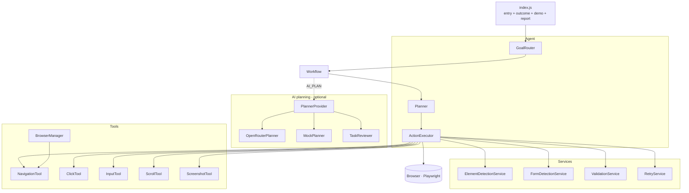
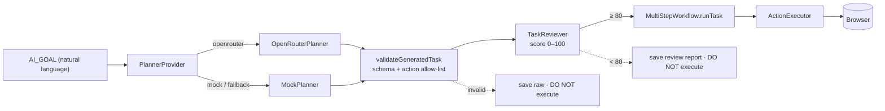

# Architecture — Website Automation Agent

Single source of truth for the system design. (Consolidates the per-phase
ARCHITECTURE_V2–V6, the AI-planner design, the outcome model, and the P3 migration notes.)

---

## 1. Overview

A modular, fault-tolerant browser-automation **agent framework** (Node.js +
Playwright). It is not a one-off script: it routes between goals, plans actions
as pure data, executes them with retries and self-healing recovery, classifies
the outcome, and can turn a natural-language goal into a runnable plan via an
LLM — all behind a stable execution engine.

Every action follows an **Observe → Think → Act → Verify (OTAV)** loop, surfaced
through a custom colour-coded Winston logger (`OBSERVE` / `THINK` / `ACT` /
`VERIFY` / `PLAN` / `RECOVERY`).

---

## 2. Layered design



**Dependency rule:** each layer depends only on the one below it. Workflows hold
only an `Agent` reference; the executor never knows where a task came from.

| Layer | Responsibility |
|-------|----------------|
| `tools/` | Thin Playwright wrappers (navigate, click, input, scroll, screenshot, browser lifecycle) |
| `services/` | Reusable logic: element/form detection, validation, retry |
| `agent/` | Orchestration: `GoalRouter`, `Planner`, `ActionExecutor`, `Agent` (composition root) |
| `workflows/` | Goal-oriented flows (declare intent, not mechanics) |
| `planners/` | AI planning (NL → task JSON) — produces input only, never executes |
| `benchmark/` | Evaluation infrastructure |
| `config/`, `utils/` | Config (`.env`), logger, diagnostics, file/report helpers |

---

## 3. Execution flow

```
GOAL (.env) → GoalRouter.route() → Workflow.run()
            → Planner.generatePlan(goal, params) → action[] (pure data, logged)
            → ActionExecutor.executeAll(action[])
            → RetryService / recovery → Tools → Playwright → Browser
```

- **Planner** is the single place that turns intent into a typed `action[]`. The
  array is pure data (no Playwright objects) — inspectable, loggable, and the
  exact format an LLM can emit.
- **ActionExecutor** dispatches each `ACTION_TYPE` to a tool. A **field registry**
  (`Map<name, Locator>`) lets later steps reference fields by name after a
  `DETECT_FIELD` scan, keeping plans serialisable.

### Element detection (accessibility-first)
`ElementDetectionService` tries strategies in priority order and returns the
first **visible** match: **label → ARIA role → placeholder → name attribute → CSS**.
Visibility filtering avoids hidden duplicates (e.g. GitHub's hidden header search
button). Confidence is logged HIGH / MEDIUM / LOW; low-confidence fallbacks warn.

---

## 4. Resilience

- **RetryService** — stateless exponential backoff (500 → 1000 → 2000 ms). Per-action
  policy in the executor: `CLICK/FILL/PRESS_KEY/DETECT_FIELD/…` retry (fatal),
  `VERIFY_URL` retries non-fatally, `NAVIGATE` is **bounded** (never infinite). A
  plan step may override fatality with `fatal: true/false`.
- **Recovery ladder** (for `DETECT_FIELD`): normal → scroll + re-scan → force full
  re-scan → capture diagnostic screenshot → fail. Each step logs at `RECOVERY`.
- **Tolerant waits** — `networkidle` and full-page screenshots are soft: a timeout
  warns and continues / falls back (e.g. viewport screenshot on very long pages)
  rather than failing the run.

---

## 5. Outcome classification

Every run ends as exactly one outcome, reported by `index.js` with a distinct
exit code so it's unambiguous without reading source:

| Outcome | Meaning | Exit |
|---------|---------|------|
| `SUCCESS` | task completed and verified | `0` |
| `BLOCKED` | site blocked automation (CAPTCHA / consent / "unusual traffic") | `2` |
| `FAILED` | real failure (nav exhausted, field not found, bug) | `1` |

A typed `BlockedError` (thrown by the `CHECK_BLOCKED` action) separates BLOCKED
from FAILED. On BLOCKED/FAILED, **Diagnostic Mode** writes
`logs/errors/error_<date>.json` (goal, workflow, outcome, blockedReason, url,
title, failed action, screenshot). Every run also writes a self-contained
`reports/report_<ts>.html`.

---

## 6. Multi-step engine (reusable JSON tasks)

`GOAL=MULTI_STEP TASK_FILE=x.json` runs any task definition — no per-task code.

```json
{ "name": "github_playwright", "vars": { "q": "playwright" },
  "steps": [
    { "action": "navigate", "url": "https://github.com/search" },
    { "action": "search", "field": "search", "value": "{{q}}" },
    { "action": "submit" },
    { "action": "verify_url", "fragment": "q={{q}}" },
    { "if": { "selector_exists": "[data-testid=\"results-list\"]" },
      "then": [ { "action": "open_first_result", "selector": "[data-testid=\"results-list\"] a" } ],
      "else": [ { "action": "screenshot", "label": "no-results" } ] } ] }
```

- **Verbs** → low-level actions via `Planner.translateTaskStep` (single source of truth):
  `navigate, search, fill, click, submit, open_first_result, wait, wait_for_selector,
  verify_selector, verify_url, scroll, screenshot`.
- **Variable substitution** — `{{token}}` resolves from a task `vars` block or env
  (`TOKEN`); unresolved → clear error.
- **Conditionals** — `{ if: { selector_exists|selector_missing|url_contains }, then, else }`
  and per-step `continueOnFailure`. Deterministic only (no loops/agent reasoning);
  evaluated step-by-step at runtime by `MultiStepWorkflow` — the executor is unchanged.

---

## 7. AI planner (natural language → task JSON)



- The AI is **planner-only** — it emits task JSON and never touches Playwright,
  the executor, or validation.
- `PlannerProvider` selects mock/OpenRouter and owns the **fallback** policy:
  transport failure (timeout / 429 / auth) → fall back to `MockPlanner`; bad
  output (unparseable / invalid schema / unknown action) → save raw, **do not
  execute**.
- `TaskReviewer` scores every plan 0–100 (name, ≥1 step, first-step-navigate,
  no empty values, no unknown actions, no duplicate consecutive steps, no useless
  plans). Only **≥ 80** runs; rejected plans are saved to
  `reports/planner_review_<ts>.json` and skipped.
- Strict JSON contract is in `src/prompts/planner-system-prompt.txt` (versioned).
- **The executor cannot tell** whether a task came from a JSON file, the Mock
  planner, or OpenRouter — all run through `MultiStepWorkflow.runTask`.

---

## 8. Benchmark (evaluation infrastructure)

`npm run benchmark` runs the 20 goals in `benchmark/goals.json` through
**plan → review → execute** and writes `reports/benchmark_report.{json,html}`.
Metrics: planning success rate, review approval rate, execution success rate,
average review score, average execution time. It reuses the planner/executor
unchanged (dependency-injected `BenchmarkRunner`).

---

## 9. Goals (registered in `GoalRouter`)

| Goal | Workflow | Description |
|------|----------|-------------|
| `FILL_SHADCN_FORM` | FillShadcnFormWorkflow | Fill the shadcn React-Hook-Form demo |
| `SEARCH_GOOGLE` | SearchGoogleWorkflow | Google search (CAPTCHA → BLOCKED) |
| `SEARCH_GITHUB` | SearchGitHubWorkflow | GitHub search (verify q= + results) |
| `MULTI_STEP` | MultiStepWorkflow | Run any task JSON file |
| `AI_PLAN` | AiPlannerWorkflow | NL goal → planner → task → run |

---

## 10. Design principles

1. **Pure-data plans** — the planner emits serialisable `action[]`; the executor
   is the single, stable runtime.
2. **One translation seam** — task verbs → actions live in one method, so an LLM
   plugs in without executor changes.
3. **Fail observably** — every failure is a distinct outcome with a diagnostic
   report; the browser never runs an invalid or low-quality plan.
4. **Reuse over addition** — new goals are one `register()` call; new tasks are a
   JSON file; resilience compounds across all of them.
