# Architecture V6 — Multi-Step Workflow Engine

## What changed in V6

V5 had three **hardcoded** goals, each with a dedicated `_plan<Goal>()` method
and a workflow class. V6 adds one **generic** goal — `MULTI_STEP` — that executes
*any* reusable task defined in a JSON file, with **no new class per task**.

```mermaid
flowchart LR
    TF[Task File<br/>tasks/*.json] --> MS[MultiStepWorkflow]
    MS -->|loadTask + validate| PL[Planner._planMultiStep]
    PL -->|action&#91;&#93;| EX[ActionExecutor]
    EX --> RS[RetryService] --> RC[Recovery] --> T[Tools]
    T --> B[(Browser)]
    EX -.failure/blocked.-> D[Diagnostics + Outcome]
```



Nothing else changed: GoalRouter, Planner, ActionExecutor, RetryService, the
recovery ladder, Diagnostics, the SUCCESS/BLOCKED/FAILED outcomes, and all
existing workflows/tests are reused **unchanged**.

---

## Two vocabularies, one translator

The engine deliberately separates *what a task says* from *how the executor runs it*:

| Layer | Vocabulary | Example |
|-------|-----------|---------|
| **Task JSON** (human / LLM-friendly) | `navigate`, `search`, `submit`, `open_first_result`, `verify_selector`, `screenshot` | `{ "action": "search", "field": "search", "value": "playwright" }` |
| **ActionExecutor** (low-level) | `NAVIGATE`, `DETECT_FIELD`, `CLICK`, `FILL`, `PRESS_KEY`, `OPEN_FIRST_RESULT`, … | `{ type: "DETECT_FIELD", field: "search" }` |

`Planner._planMultiStep()` is the **single translation point** between them. One
task verb expands to one or more executor actions, e.g.:

```
search {field,value}  →  DETECT_FIELD + CLICK + FILL
submit {key?}         →  PRESS_KEY + WAIT + WAIT_FOR_IDLE
open_first_result {selector?}  →  OPEN_FIRST_RESULT + WAIT_FOR_IDLE
```

**Site-specifics live in task data, never in code.** The `open_first_result`
action is generic; the GitHub results selector lives in `github_playwright.json`.

---

## New action types (generic, reusable — not site-specific)

| Action | Purpose |
|--------|---------|
| `OPEN_FIRST_RESULT` | Click the first visible link in a results region (selector-parameterized; generic default fallback) |
| `WAIT_FOR_SELECTOR` | Wait until a CSS selector becomes visible |
| `VERIFY_SELECTOR` | Assert a CSS selector is present/visible (hard gate by default) |

All three retry with backoff and participate in the existing outcome model.

---

## Task schema

```json
{
  "name": "github_playwright",
  "description": "optional human note",
  "steps": [
    { "action": "navigate", "url": "https://github.com/search" },
    { "action": "search", "field": "search", "value": "playwright" },
    { "action": "submit" },
    { "action": "verify_url", "fragment": "q=playwright" },
    { "action": "verify_selector", "selector": "[data-testid=\"results-list\"]" },
    { "action": "open_first_result", "selector": "[data-testid=\"results-list\"] a" },
    { "action": "screenshot", "label": "repo" }
  ]
}
```

Supported verbs: `navigate`, `search`, `fill`, `click`, `submit`,
`open_first_result`, `wait`, `wait_for_selector`, `verify_selector`,
`verify_url`, `scroll`, `screenshot`.

Validation happens in two layers:
- **Structural** (`MultiStepWorkflow.validateTask`): `name` + non-empty `steps[]`, each with a string `action`.
- **Semantic** (`Planner._planMultiStep`): each action is supported and has its required params; otherwise it throws `unsupported action "X" at step N`.

Both throw clear errors → the run ends as **FAILED** with a diagnostic report.

---

## Running

```bash
GOAL=MULTI_STEP TASK_FILE=github_playwright.json npm start
# or the convenience script:
TASK_FILE=shadcn_demo.json npm run task
```

`GOAL` selects the generic workflow; `TASK_FILE` selects the data. No code edits.

---

## The future OpenAI seam

```
Today:   Task JSON ──────────────→ Planner._planMultiStep → ActionExecutor → Browser
Future:  Natural Language → OpenAI → Task JSON → Planner._planMultiStep → ActionExecutor → Browser
```

An OpenAI planner would emit the **exact same task JSON** this engine already
consumes. It plugs in *before* `_planMultiStep` and changes **nothing**
downstream — the executor, retry, recovery, diagnostics, and outcomes are
untouched. The task schema is the stable contract. See
[MIGRATION_P3.md](MIGRATION_P3.md).

---

## V6.5 hardening (P3.5) — before OpenAI

The engine was strengthened so a future LLM planner can emit task JSON and rely
on these without any executor change:

```
Task JSON → Variable Resolution → Conditional Evaluation → Planner → Executor → HTML Report
```

- **Variable substitution** (`resolveVariables`, in `loadTask`): `{{token}}` in any
  string resolves from `task.vars` then env (`TOKEN`); unresolved → clear error.
- **Conditional execution** (`MultiStepWorkflow._runSteps` / `_evaluateCondition`):
  `{ if: { selector_exists|selector_missing|url_contains }, then: [...], else: [...] }`
  plus per-step `continueOnFailure`. Deterministic only — no loops, no reasoning.
  Because conditions depend on **live page state**, the workflow executes
  **step-by-step** (translating each step via `Planner.translateTaskStep`) rather
  than building one static plan. The executor is unchanged.
- **HTML run report** (`utils/report.js` + a passive logger memory transport):
  every run writes `reports/report_<ts>.html` (goal, task, times, outcome, steps,
  retries, recovery, screenshots, final URL) — self-contained, no external deps.
- **Robustness fix** surfaced by real-site validation: `WAIT_FOR_IDLE` (network
  idle) is now a soft settle — a timeout warns instead of failing the run.

Validated live on three unrelated sites with **task JSON only**: Wikipedia
(variables + continueOnFailure), Hacker News (open first result), Stack Overflow
(conditional `if/then/else` gracefully handling its anti-bot page).

## File map (V6 additions)

```
src/
  workflows/MultiStepWorkflow.js   ← NEW generic workflow + loadTask/validateTask
  agent/Planner.js                 ← + _planMultiStep() translator
  agent/ActionExecutor.js          ← + OPEN_FIRST_RESULT / WAIT_FOR_SELECTOR / VERIFY_SELECTOR
  services/ValidationService.js    ← + waitForSelector / verifySelectorPresent
  agent/Agent.js                   ← register MULTI_STEP → MultiStepWorkflow
  config/constants.js              ← MULTI_STEP goal, 3 actions, DEFAULT_RESULT_LINK_SELECTOR
  config/env.js                    ← config.task.file (TASK_FILE)
tasks/
  github_playwright.json  github_openai.json  shadcn_demo.json   ← NEW
tests/
  multistep.test.mjs               ← NEW (5 scenarios)
```
